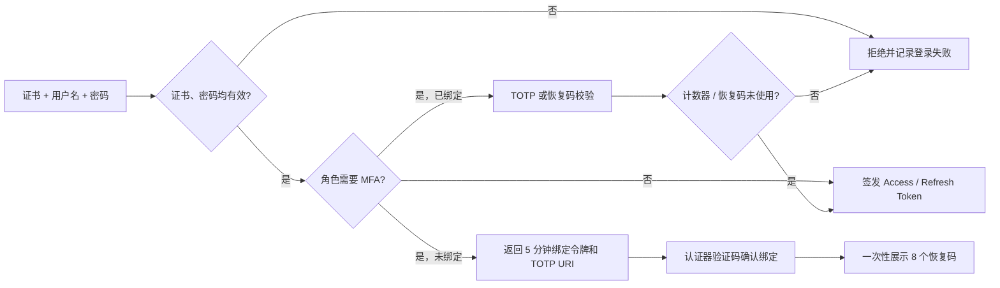
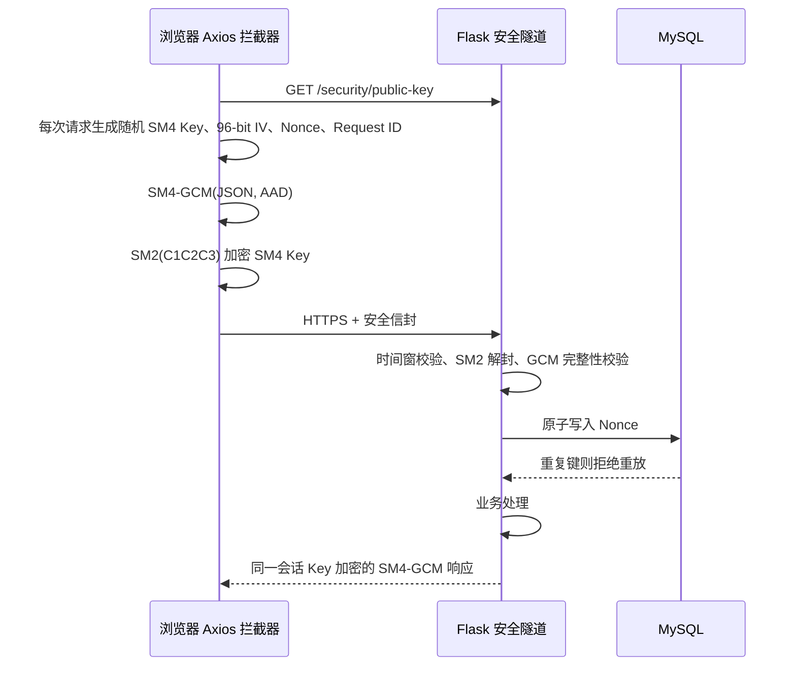

# 第 2、4 周任务实现与验收说明

本文按《安全电子商务系统 III 第一次课》的第 2 周和第 4 周要求整理。课件只作为需求参考；系统实现仍以本仓库代码和安全边界为准。

## 第 2 周：角色、权限、TOTP 与审计

### 权限矩阵（界面 / 资源 / 操作）

| 角色 | 可见界面 | 资源范围 | 允许操作 | 明确禁止 |
| --- | --- | --- | --- | --- |
| 普通用户 `user` | 商城、个人中心、购物车、订单 | 自己的资料、购物车、订单与支付 | 浏览商品，维护自己的购物车，下单、取消自己的订单、发起自己的支付 | 用户管理、审计中心、发布商品、访问他人订单 |
| 商户 `merchant` | 商城、个人中心、商品管理 | 自己发布的商品 | 新增、修改、下架自己的商品 | 修改其他商户商品、购物车/下单、用户管理、审计中心 |
| 管理员 `admin` | 用户管理、商品管理、安全审计 | 全站用户与商品、审计记录 | 调整角色、禁用其他用户、签发证书、管理任意商品、查看/导出审计 | 禁用或降级自己；未完成 TOTP 时取得管理会话 |
| 审计员 `auditor` | 安全审计、个人中心 | 权限矩阵和审计记录（只读） | 查询、筛选、导出审计日志 | 修改用户、商品、订单或审计记录；未完成 TOTP 时取得审计会话 |

后端最终授权由 `role_required`、资源所有者条件和数据库查询共同执行，前端菜单隐藏只是体验优化，不能替代后端鉴权。

### 数据库设计

| 表 | 关键字段 | 用途与约束 |
| --- | --- | --- |
| `users` | `role`、`totp_secret`、`totp_enabled`、`totp_last_counter`、`recovery_codes_json` | 四角色；TOTP 密钥使用 SM4 加密保存；最后一次计数器单调递增；恢复码保存 SM3 摘要 |
| `products` | `seller_id`、`status`、`price_cents`、`stock` | 商品归属商户；金额以分存储；商户更新条件同时校验商品 ID 和所有者 ID |
| `cart_items` / `orders` / `order_items` | `user_id`、`order_no`、金额与状态字段 | 普通用户资源按 `user_id` 隔离；下单使用事务与库存锁 |
| `secure_request_nonces` | `nonce` 主键、`request_id`、`expires_at` | 数据库唯一键原子防重放；定期清理过期 Nonce |
| `audit_logs` | 操作者、角色、事件、资源、操作、结果、HTTP 状态、IP、路径、时间 | 追加式安全审计；管理员和审计员只读查询/导出 |

服务启动时会以幂等方式创建表并补齐旧库所缺字段，便于从原实验数据库平滑升级。

### 管理员 / 审计员登录流程



- TOTP：SHA-1、6 位、30 秒周期，允许前后各一个时间步的小范围时钟漂移。
- 防复用：TOTP 计数器以条件更新原子消费；同一计数器不能再次登录。
- 恢复码：仅绑定成功时明文展示一次，数据库只保存 SM3 摘要，并通过行锁原子消费。
- 管理/审计 JWT 带 `mfa_verified` 声明；刷新和每次鉴权都会重新读取当前角色，避免降权后旧 Token 继续越权。

### 审计事件字典

| 事件 | 触发条件 | 结果值 | 主要字段 |
| --- | --- | --- | --- |
| `AUTH_LOGIN` | 证书、密码及所需 MFA 全部通过，或证书/密码失败 | `success` / `denied` | 用户、角色、IP、MFA 状态或失败原因（不记录密码和证书内容） |
| `AUTH_MFA` | TOTP 绑定/校验失败、验证码复用或恢复码无效 | `denied` | 用户、角色、IP、失败原因（不记录验证码、恢复码或 TOTP 密钥） |
| `<BLUEPRINT>.<ENDPOINT>` 大写形式 | 已认证用户执行写操作、特权读取或发生失败 | `success` / `denied` / `failure` | 资源 ID、方法、路径、HTTP 状态、是否使用安全信封 |

审计接口：`GET /api/v1/security/audit-logs`；CSV 导出：`GET /api/v1/security/audit-logs/export`。

### 越权验收用例

| 用例 | 期望 |
| --- | --- |
| 普通用户调用用户列表、角色修改或审计接口 | `403` |
| 商户修改/下架其他商户商品 | `403`，且商品不变 |
| 审计员调用任意修改接口 | `403` |
| 普通用户访问他人订单或购物车项 | `404/403`，不泄露资源详情 |
| 公开注册提交 `role=admin` | 创建的账号仍固定为 `user` |
| 管理员/审计员跳过 TOTP 或复用验证码 | `401/409`，不签发特权会话 |

演示账号应通过公开注册先创建，再由现有管理员在“用户管理”中分配 `merchant`、`admin`、`auditor` 角色。不要把固定演示密码、证书私钥或恢复码提交进仓库。

## 第 4 周：SM2 + SM4-GCM 应用层安全信封

### 请求流程



### 请求格式

敏感 JSON 写请求使用以下请求头：

```http
Content-Type: application/json
X-Secure-Envelope: 1
```

请求 Body 是安全信封，不再直接发送原始业务 JSON：

```json
{
  "version": "1",
  "algorithm": "SM2+SM4-GCM",
  "encrypted_key": "<SM2 C1C2C3 hex>",
  "iv": "<12-byte hex>",
  "ciphertext": "<hex>",
  "tag": "<16-byte hex>",
  "nonce": "<random hex>",
  "timestamp": 1700000000000,
  "request_id": "<random hex>"
}
```

| 字段 | 格式与长度 | 说明 |
| --- | --- | --- |
| `version` | 固定字符串 `1` | 协议版本 |
| `algorithm` | 固定字符串 `SM2+SM4-GCM` | SM2 数字信封与 SM4-GCM 正文加密 |
| `encrypted_key` | 十六进制字符串 | 使用服务端 SM2 公钥按 C1C2C3 模式封装的 16 字节 SM4 会话密钥 |
| `iv` | 24 个十六进制字符 | 每次请求随机生成的 12 字节 GCM IV |
| `ciphertext` | 偶数长度十六进制字符串 | 原始业务 JSON 的 UTF-8 密文 |
| `tag` | 32 个十六进制字符 | 16 字节 GCM 完整性标签 |
| `nonce` | 32 个十六进制字符 | 每次请求随机生成的 16 字节防重放值 |
| `timestamp` | 13 位 Unix 毫秒时间戳 | 服务端默认接受当前时间前后 120 秒 |
| `request_id` | 32 个十六进制字符 | 每次请求随机生成，用于请求响应关联 |

请求 AAD 使用 UTF-8 编码，换行符固定为 `\n`，不传输但双方必须按完全相同的规则计算：

```text
<大写 HTTP 方法>\n<请求路径>\n<timestamp>\n<nonce>\n<request_id>
```

例如：

```text
POST
/api/v1/users/register
1700000000000
0123456789abcdef0123456789abcdef
abcdef0123456789abcdef0123456789
```

HTTP 方法、请求路径、时间戳、Nonce 或 Request ID 中任意一项被修改，都会导致 GCM 标签校验失败。服务端校验成功后将 Nonce 写入 MySQL，唯一键冲突即判定为重放。401 刷新后重试会恢复原始业务数据并重新生成 Key、IV、Nonce 和 Request ID，不会重复使用旧信封。

### 响应格式

对于通过安全信封进入的请求，服务端使用同一请求的 SM4 会话密钥加密 JSON 响应，并返回：

```http
Content-Type: application/json; charset=utf-8
X-Secure-Response: 1
Cache-Control: no-store
```

响应 Body：

```json
{
  "version": "1",
  "algorithm": "SM4-GCM",
  "request_id": "<与请求相同的 request_id>",
  "iv": "<新生成的 12-byte IV hex>",
  "ciphertext": "<响应 JSON 的 UTF-8 密文 hex>",
  "tag": "<16-byte GCM tag hex>"
}
```

响应不再重复传输 SM2 加密的会话密钥。客户端使用请求阶段暂存在内存中的 SM4 会话密钥解密，完成后由 JavaScript 运行时回收。响应 AAD 为：

```text
RESPONSE\n<request_id>
```

客户端必须同时验证 `X-Secure-Response: 1`、`algorithm` 和 `request_id`，然后验证 GCM 标签；任一检查失败都不得把响应交给业务代码。

### 失败响应与状态码

| HTTP 状态 | `details.reason` | 触发条件 |
| --- | --- | --- |
| `400` | `envelope_required` | 敏感 JSON 请求没有使用安全信封 |
| `400` | `invalid_envelope` | 字段缺失、版本或算法错误、十六进制格式错误等 |
| `400` | `invalid_tag` | 密文、Tag 或 AAD 绑定字段被篡改 |
| `408` | `expired_timestamp` | 时间戳超出默认前后 120 秒窗口 |
| `409` | `replay_detected` | Nonce 已被成功消费，检测到重放 |

安全信封建立成功后，业务校验失败响应也使用 SM4-GCM 加密。例如测试脚本故意提交缺少注册字段的业务数据时，HTTP `400` 是业务校验结果，但响应仍必须带 `X-Secure-Response: 1` 并能被客户端正确解密。

如果请求在时间窗、SM2 解封、GCM 完整性或重放检查阶段已经失败，服务端尚未得到可信的会话密钥，因此对应的 `invalid_envelope`、`invalid_tag`、`expired_timestamp` 和 `replay_detected` 错误使用普通 JSON 返回，并继续由 HTTPS 保护。客户端不得把这些错误当作已建立安全信封的业务响应。

### 密钥生命周期与安全边界

- SM4 会话密钥：浏览器为每个请求调用密码学安全随机源生成 16 字节密钥，只在该请求和对应响应期间保存在内存中，不写入 LocalStorage、SessionStorage、日志或数据库。
- IV、Nonce、Request ID：每个请求独立随机生成；响应另行生成新的 12 字节 IV。任何请求重试都必须重新生成全部随机值。
- SM2 服务端密钥：公钥通过 `GET /api/v1/security/public-key` 发布；私钥仅保存在服务端，由 `TUNNEL_KEYS_DIR` 指定目录加载。部署时应使用仅服务账号可读的密钥目录或密钥管理服务，禁止把真实私钥提交到 Git。
- 密钥轮换：更换服务端 SM2 密钥对后重启服务，客户端公钥缓存会在页面刷新后重新获取；轮换期间不得继续接受由旧私钥解封的新请求。
- TLS：HTTPS 仍然强制启用。应用层安全信封用于敏感 JSON 的二次保护和篡改/重放检测，不能替代 TLS 的服务器身份认证和传输层保护。

登录接口需要上传证书，使用 `multipart/form-data`，其中的密码由 HTTPS 保护；商品图片上传继续使用限定接口的 `multipart/form-data`；银行回调使用独立支付信封。除此之外，所有 API 的 POST/PUT/PATCH/DELETE 请求默认强制安全信封。没有业务 Body 的写请求会先规范化为 `{}` 再加密，因此订单创建、取消、支付启动和无 Body 的删除操作也受到时间窗与 Nonce 防重放保护。

### 自动验收

后端测试（时间窗、篡改、重放、TOTP 漂移）：

```powershell
.\venv\Scripts\python.exe -m unittest discover -s api_service4\tests -v
```

前端 SM4 标准向量和 GCM 往返：

```powershell
cd api-service4-frontend
npm run test:crypto
```

启动后端后执行真实端到端测试：

```powershell
npm run test:tunnel-live
```

`test:tunnel-live` 自动验证：

- 加密错误响应能够正确解密；
- 原样重放返回 `409 replay_detected`；
- 修改密文返回 `400 invalid_tag`；
- 修改受 AAD 保护的 Request ID 返回 `400 invalid_tag`；
- 使用合法加密但过期的时间戳返回 `408 expired_timestamp`；
- 连续请求的 SM4 Key、Encrypted Key、IV、Nonce 和 Request ID 全部变化。

该脚本只发送无法通过业务字段校验的测试负载，不会创建演示用户。测试脚本仅为本机自签名开发证书关闭证书校验；正常浏览器和生产环境不得关闭 TLS 校验。实际执行环境、步骤和结果保存在 `api_service4/docs/week4-security-tunnel-test-record.md`。

### 手工抓包验收

1. 在浏览器网络面板观察注册、角色更新或其他 JSON 写请求；正文只应看到 `encrypted_key/iv/ciphertext/tag/nonce/timestamp/request_id`，不应看到业务明文。
2. 原样重发同一请求，应返回 `409 replay_detected`。
3. 修改 `ciphertext`、`tag` 或 AAD 相关字段，应返回 `400 invalid_tag`。
4. 把时间戳改到时间窗外并重新构造信封，应返回 `408 expired_timestamp`。
5. 连续两次正常请求的 `encrypted_key`、`iv`、`nonce` 和 `request_id` 应全部不同。

## 启动方式

在项目根目录启动后端：

```powershell
.\venv\Scripts\python.exe -m api_service4.run
```

启动前端：

```powershell
cd api-service4-frontend
npm run serve -- --port 8081
```

注意 `npm run serve 8081` 会把 `8081` 当作入口文件路径传给 Vue CLI，从而触发 `paths[1]` 类型错误；端口参数前必须有 `-- --port`。
